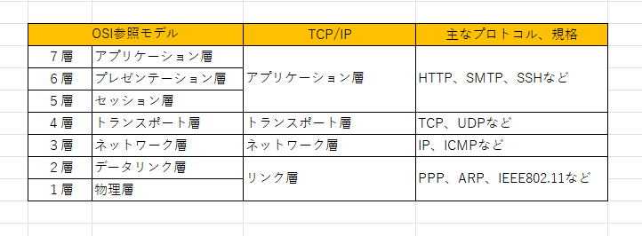
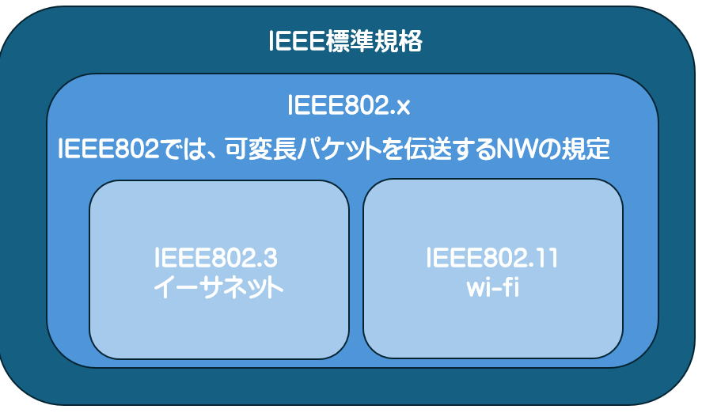
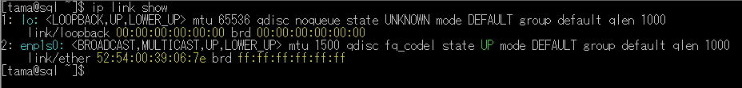
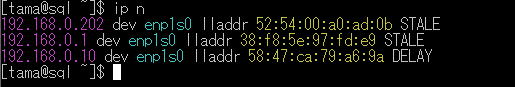
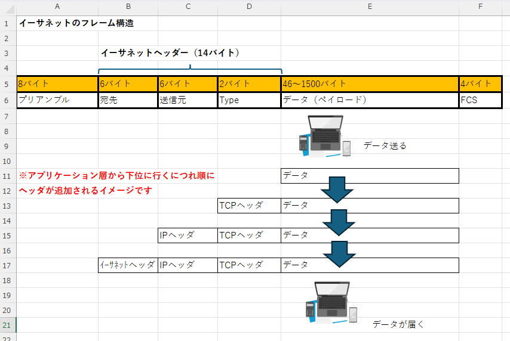
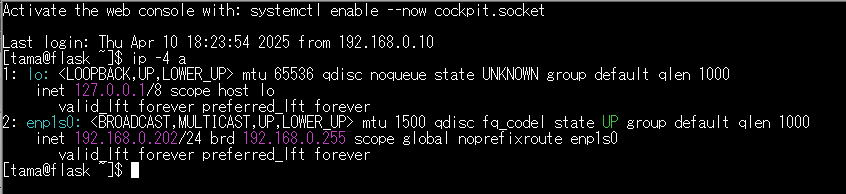
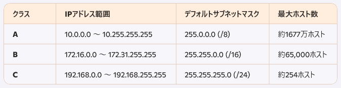
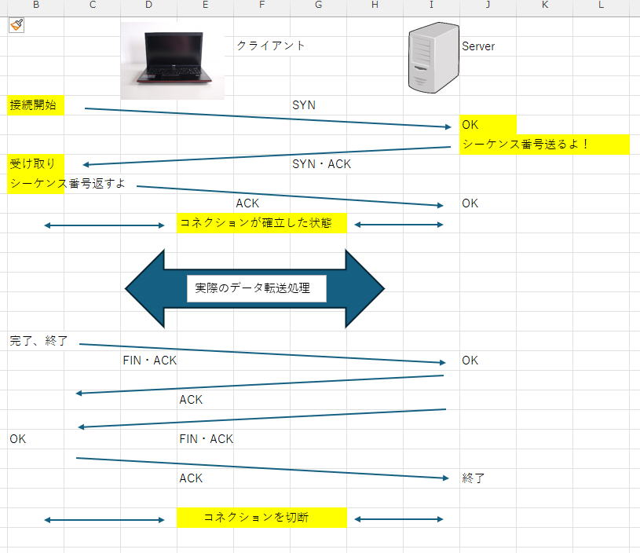

# TCP/IPの基礎知識

TCP/IP は、インターネットや社内LANで使われている「通信の約束事（プロトコル群）」です。
インフラでもアプリでも、最低限の仕組みを押さえておくと **疎通確認・障害切り分け** が楽になります。

---

## TCP/IP

お疲れ様です。インフラ系であってもアプリ開発であってもインターネットのネットワークについての基礎知識は必要であります。
最低限知っておきたいインターネットのネットワーク知識を説明したいと思います。
インターネットの通信にはTCP/IPプロトコルが利用されます。IP アドレスと呼ばれるものを利用し、接続します。
IP アドレスには LAN などで使う ローカルアドレス、世界中で使うグローバルアドレスに分けられます。
ローカルアドレスは会社や家庭内におけるプライベートなアドレスであり、プライベートな空間であれば重複しても問題ありません。
しかし、グローバルアドレスは世界にたった1つであり 重複は許されません。これからTCP/IPの基礎 学習していきましょう。

ローカルエリアネットワークの中ではいわゆるLANと言いますが家庭内のスマートフォンやパソコンなど使ってると思います。
会社では プリンターや 複数のパソコン ネットワーク機器が繋がっていると思います。
これらのネットワーク機器やPC は物理的なネットワークケーブルでつながれていたり wi-fi で接続されていたりします。
これらは後で説明する 同じネットワークセグメントに属する必要があります。

また他の家や他の会社など別のネットワーク と通信をするために使われている機器がルーターと言います。
ルーターは自分が担当しているネットワーク宛の通信であれば通信相手の物理アドレス（MACアドレス）を調べて 
パケットを転送し、自分が担当していないネットワークであれば別のルーターにパケットを転送します。自分が担当していないネットワークについては
物理アドレスを把握してる必要はありません。TCP/IPは大きく分けて4つの層に分かれています。

最下層の部分は物理的な部分を相当するリンク層です。この層はハードウェアの制御やどのような電気信号をどう送るかということを取り決めています。
次の層がインターネット層です。TCP/IPのIP の部分がこのプロトコルの層で IP を通じて ローカルネットワークを超えた通信が実現されます。
インターネット層は、ネットワーク層と呼ばれることもあります。

その上に位置するのがトランスポート層です。TCPはこの層のプロトコルであり IP によって送られてくるデータの確認やデータの整合性の検証などを行います。
そして一番最上位に来るのが アプリケーション層 です。具体的なサービスや 例えば Web やメールなどが実現されるのはこの層で、
Web で使われているHTTPはアプリケーション層のプロトコルです。

リンク層ではハードウェアに割り当てられたMACアドレスを使って通信相手を特定します。インターネット層では IP アドレスを使います。
PC やスマートフォンなど インターネットに接続している機器には Mac アドレスと IP アドレスが割り振られています。
現在インターネットで使用されている IP アドレスは IPv4 とIPv6の2種類で、IPv4 はアドレスを 32 bit で 、IPv6は128ビットで表現します。ここら辺に関しては後で説明します。

Mac アドレスは 物理アドレス、IP アドレスは 論理アドレスと呼ばれることがあります。アドレスが2段階になっているので 通信相手がハードウェアを交換しても
同じ IP アドレスをつけていれば 今までと変わりなく通信できます。
トランスポート層は IP アドレスで通信相手のホストを指定しさらに 相手ホストのどのサービスに接続するかを ポート番号で指定します。
これにより 1台のサーバーで複数のサービスを提供できることになります。

#### 図: tcpip01.jpg

**上記の図のように、複数のプロトコルが 階層的に積み重なって機能することをプロトコルスタックと言います。TCP/IP のプロトコルスタックはリンク層 インターネット層 トランスポート層 アプリケーション層という4つのレイヤーで成り立っています。OSI 参照モデル が定義する7つの層は概念的なプロトコル群ということになります。**

---

## ネットワーク上を流れるデータについて

ネットワーク回線に流れるのは 0と1のデジタルデータで1ビットずつ送られています。通信速度を表現する bpsは、1秒間に何ビットのデータを送れるかを表現しています。
ネットワーク通信ではデータをパケットという単位に分割して送受信します。
データをパケットに小分けにすることで 回線利用効率を上げデータが破損した際に送り直します これは TCP の役割となります。

## パケットについて

ネットワークにおける通信は 例えば Web サーバーと Web ブラウザ など アプリケーション層のやり取りは基本的に同じ階層同士で行われます。
実際の物理的な電気信号のやり取りは最下層のリンク層で行われます。データは上位の層から下位の層へ移るごとにヘッダーが追加されます。
ヘッダーの追加は 各層で行われており 低レベル 層での通信のために ヘッダーが追加されていくことを カプセル化と言います。
逆に ヘッダーを取り除く過程を非カプセル化と呼びます。
TCP/IPにおけるパケットのサイズは、ネットワーク環境やプロトコルの設定によって異なるが、通常は次のような仕様がある。

**IPパケットの最大サイズ**

①　IPv4　最大サイズは65,535バイト（ヘッダーを含む）。
②　IPv6　最大サイズは65,575バイト（ヘッダーを含む）。

**MTU (Maximum Transmission Unit)**

MTUとは、一度に送信可能な最大データサイズのことです。
①　一般的には1,500バイト（イーサネットの標準MTU）が使用される。
②　MTUを超えるデータは「フラグメンテーション」と呼ばれる分割処理が行われる。

**TCPセグメントのサイズ**

・TCPセグメントは、IPパケット内に収められる。
・通常はTCPヘッダー（20バイト）とデータ部分を含めたサイズがMTU以下になるよう調整される。
・例えば、1,500バイトのMTUの場合、IPヘッダー（20バイト）とTCPヘッダー（20バイト）を除いたデータの最大サイズは1,460バイトになる。

MTU（最大転送単位）は基本的にはネットワーク環境やデバイス設定に依存して決まるが、多くのケースで「自動的」に適切なサイズが設定される。

### 具体的な仕組み

・デフォルト設定　多くのデバイスやネットワーク機器は、標準のMTUサイズ（例えばイーサネットの場合は1,500バイト）を採用している。
・パスMTUディスカバリー (PMTUD)　ネットワーク上のルートにおける最適なMTUサイズを検出するプロセス。

**これにより、フラグメンテーションを回避し効率的なデータ転送が可能になる。**
**MTUは、手動で調整することも可能**

---

## リンク層

**ネットワークデバイス と Mac アドレスについて**

ネットワークデバイスは、コンピューター通信のデータの送受信や 転送を行うための機器です。一般的にはNIC、いわゆる ネットワークインターフェースカードです。
その他 wi-fi があります。前述したデータ通信の仕組みを7つの階層に分けて理解します。OSI 参照モデル ってやつです。

**イーサネットと wi-fi**

会社のネットワークや家庭内のネットワークなど 限定された範囲で使用されるネットワークを LAN と言いまして、いわゆる ローカルエリアネットワークと言います。
LAN構築する際の代表的な通信規格が イーサネットと wi-fi です。

#### 図: tcpip02.jpg

イーサネットはネットワークケーブルを介して通信を行う規格で速度とケーブルの種類で呼ばれます。
昔の10BASE-Tは、10Mbps のツイストペアケーブルという種類のケーブルが使用されており その後 100BASE-Tや1000BASE-TXが
普及されるようになりました。ツイストペアケーブルには カテゴリー 5、6、7 などの種類があり 混在させて使えますが それぞれ 対応する最高速度や
推奨される最大長 などが異なります。最近では ギガビットイーサネットとか 10ギガビットイーサーネットが主流となっています。
イーサネットの規格名にはIEEE(アイトリプルイー)という標準化団体による名称が使われています。
すでにほとんど使われなくなった10BASE-Tは802.3i、1000BASE-Tは802.3abとなります。
wi-fiは無線でデータ通信を行う規格で11Mbpsの802.11b、最大54Mbpsの802.11aや802.11bなどがあります。最近のイーサネット規格では、
100GBASE-T（100ギガビット/秒）が非常に高速なデータ転送速度を提供します。

**MACアドレスは、リンク層のアドレス**

リンク層では、Mac アドレスを使って通信相手を特定します。
Mac アドレスはハードウェア アドレスや 物理アドレスとも呼ばれており ネットワークに接続されている機器は全て Mac アドレスがつけられています。
Mac アドレスはユニークなアドレスで世界で1つだけしか存在しません。この辺はしっかり 管理されています。ハードウェアベンダーが管理しています。
Mac アドレスは48ビットで表されています。2桁の16進数×6で表現されます。

#### 図: tcpip03.jpg

2: enp1s0: <BROADCAST,MULTICAST,UP,LOWER_UP> mtu 1500 qdisc fq_codel state UP mode DEFAULT group default qlen 1000
link/ether **52:54:00:39:06:7e** brd ff:ff:ff:ff:ff:ff　　※赤の部分がMACアドレスです。（MACアドレスは、仮で作成しましたので悪しからず）

**IP アドレスはネットワーク層のアドレス**
Mac アドレスがリンク層のアドレスであるのに対して IP アドレスは、インターネット層で使用されるアドレスです。
Mac アドレスと IP アドレスは 物理アドレスと 論理アドレスという違いがあるだけでなく 適用範囲が違います。

IP アドレスはインターネット 全体で通信相手を特定するのに使われるのに対し Mac アドレスは自宅の中や 会社内 など デバイス同士が
直接やり取りする 限られた範囲内の通信相手を特定するのに使います。

**MACアドレスを解決する ARP と NDP**
TCP/IP通信では通常通信相手を指定する際に IP アドレスを使用します。
実際には 電気信号を届けるには リンク層のアドレスであるMACアドレスが必要になります。IP アドレスに対応する MAC アドレスを
見つけることをアドレス解決といい ipv 4ではARP(アープ)というプロトコルが使われています。
ipv 6ではNDP を使用します。

ARP は 一斉送信でアドレスを尋ねる 仕組みです。
通信を行いたい機器はローカルネットワーク全体に向けて、この IP アドレスの所有者はどなたですか？というような問い合わせをします。
これを ARP要求パケットと言います。実際には ネットワーク全体へ ブロードキャストします。
ブロードキャストを受け取った機器はその IP アドレスが自分ではなければ無視をします。自分の IP アドレスの場合は IP アドレスと
MAC アドレスをセットにして送信元に返します。これを ARP 応答パケットと言います。**IP テーブル と MAC アドレスの対応は ARP テーブルとして メモリ内に一時的に保存され 一定時間が経過すると破棄されるのが一般的となります。**

#### 図: tcpip04.jpg

**※MACアドレスは、ダミーで作成してします。**

## パケットの呼び方について

イーサネットにおけるデータの単位はイーサネットフレーム と呼ばれます。
今まで何度か出ている通りネットワーク通信ではパケットという単位でやり取りを行いますが
データリンク層ではこの単位がフレーム と呼ばれます。
また上の層になると複数のパケットがまとまって 特定の意味や機能を持つデータの単位として扱われることが増えてきます。
例えば トランスポート層 ではその単位を セグメントと呼び アプリケーション層 では メッセージと呼ばれます。
このほか データグラムという単位が使われることもあり データグラム は配送が成功したかどうかや 到達の順序など
保障されていない場合に使われることが多い呼び方で IP や UDP のパケットが該当します。

## イーサネットのフレームの構造

**イーサネットフレームは** フレームの始まりを示す 64 bit の制御信号（プリアンブル）と末尾にあるエラーチェック用の32ビットのブロック（FCS）があります。
プリアンブルとFCSの説明を少々してみましょう。

**プリアンブル (Preamble)**

**役割**

①　プリアンブルはイーサネットフレームの先頭に配置される部分で、通信の同期を確立するために使われます。
②　送信側と受信側のタイミングを合わせるための特定のビットパターンを提供します。

**構成**

①　プリアンブルは通常7バイト（56ビット）で、10101010のビットパターンが繰り返されています。
②　プリアンブルの後にはSFD (Start Frame Delimiter) が続きます。この1バイト（8ビット）は10101011で構成され、フレームの開始を示します。

**役割の重要性**

①　プリアンブルがあることで、受信側がフレームの開始位置を正確に認識でき、データ通信が安定します。

**FCS (Frame Check Sequence)**

**役割**

①　FCSはフレームの末尾に配置されるエラー検出の仕組みで、データ通信が正確に行われたかどうかを確認します。
②　 FCSは送信側で生成され、受信側で検証されます。

**構成**

①　FCSは通常4バイト（32ビット）です。
②　FCSの中にはCRC（Cyclic Redundancy Check）アルゴリズムによって計算された値が含まれています。

**動作の流れ**

①　送信側: 送信するフレームのデータ部分をもとにCRCを計算し、FCSフィールドにその値を追加します。
②　受信側: 受信したデータをCRCで再計算し、FCSに含まれている値と一致するか確認します。
③　結果:- 一致: フレームにエラーがないと判断。
④　不一致: フレームが破損している可能性があるため破棄される。

**まとめ**

①　プリアンブル: フレーム開始前にタイミングを同期するためのビットパターン。
②　FCS: フレームのエラーを検出するための最後のチェック機構。

#### 図: tcpip05.jpg

データ部分は ペイロードと呼ばれていて ネットワーク通信ではヘッダーなどの情報を取り除いた 正味の データ部分です。
イーサネットのペイロードは最大1500バイトになってます。ARP のパケットの場合 ペイロード 部分に ARP メッセージが入るのに対し、
pingのパケットでは IP ヘッダーとペイロードが入り TCP のパケットの場合は さらに TCP ヘッダーが入ることになります。
リンク層での伝送にはこれらの情報は 使用されません。イーサネット ヘッダーの情報に基づいて Mac アドレスのみを参照して送信されます。
イーサネットのフレームは基本的にリンク層で接続されている全てのデバイスに転送され 各デバイスは 自分宛のものだけを受け取ります。
接続されている機器が多いと コリジョンが発生しやすくなり効率が悪くなるので、このような場合 スイッチングハブを使うのが一般的です。
スイッチングハブは Mac アドレスを参照して 適切なポートにのみ パケットを流すので一般的にはスイッチングハブを使いますね。

## インターネット層

### ネットワーク と IP アドレス

これから 説明するインターネット層はネットワークを超えて違うセグメントと通信できるようになります。
IPv4 と IPv6が、ありますが IPv4に着目して説明いたします。IPv6は徐々に使われ始めていますが一般的にはまだすごく
普及しているわけではないです。
IP アドレスはネットワークアドレスとホストアドレスで構成されています。
Macアドレスはローカルネットワークの中で同じネットワークに属する機器同士の通信に使われています。
しかし 全て同じネットワークというわけではないのでネットワークにおいて同じネットワークかどうかの識別に
IP アドレスが使われます。
IP アドレスは前述したように ネットワークアドレスとホストアドレスに分かれています。
ネットワークアドレスが同じであるグループ内では直接やり取りができます。
しかし ネットワークアドレス（ネットワークセグメント）が、違う相手と通信をする際にはルーターと言ったり、ゲートウェイと
呼ばれる装置が必要になります。この辺に関しては後で説明しますね。
家庭内のような 狭い範囲で使用し機器も少ないネットワークの場合、全体で一つの ネットワークとして運用するのが一般的です。
しかし、大きな会社などでローカルエリア内に多くの機器があったり 複数の部門に分かれて業務を行う場合は ローカルネットワークを
いくつかに分割して管理することは必要です。このように分割されたネットワークのことをサブネットと呼びます。

大きなネットワークを複数の小さなネットワークに分割するサブネット化によってネットワーク内のパケットを減らしたり
機器を管理しやすくする効果があるということになります。

### ルーティングテーブルの利用

**違うセグメントのネットワーク同士で異なるネットワークに属する機器とやり取りを行うには ルーティングテーブルが必要になります。**

ルーティングテーブルとは 経路の情報をまとめたものです。
ルーティングテーブルにないセグメントに対する通信には 全て デフォルトゲートウェイという決められた機器に転送することになります。
いわゆる ルーターってやつですね。

**自分の所属する ネットワークで解決できなかったものは全てルーター（デフォルトゲートウェイ）に送って解決します。**

通常 会社内のネットワークに属さない IP アドレスの場合はほとんど このデフォルトゲートウェイに転送され 外部のインターネットに
接続するということになるかと思います。
※ローカルエリアネットワークの外の場合はまだ 説明してありませんが DNS（名前解決）など必要になってきます。
この辺りはまた後で説明させてください。

インターネットで使われるグローバルアドレスはローカルエリアネットワークのアドレスとは 違います。
ローカルで使う IP アドレスに関しては、はっきり言って 何でも良いということですが **グローバル IP アドレスは100% 世界に一つしかない IP アドレスでないといけません。**
この辺は日本では jpニック（JPNIC）という団体が管理しています。
なので 個人的に IP アドレスを取るときは JPNICに加盟している、団体のプロバイダーからアドレスを取得しなければなりません。
この辺は話がそれるので このくらいにしておきましょう。

### IPv4

IPv4はインターネットの初期から使われていますが 今もメインで使われています。
IPv6もあるけれども まだ完全に普及しているとは言えない状況です。IPv4の弱みとしては32ビットの長さで表現するので
これだけインターネット デバイスが普及してる中で IP アドレスの不足が懸念されています。そこでIPv6があるんですが
まだ 普及しているとは言えない状況です。ここでは IPv4 のお話をしていきます。
IPv4は32ビットの値を8ビットずつ4つの数値で区切ります。（合計32ビット）

**二進数　11000000.10101000.00000000.00000001**

**十進数　192.168.0.1**

PC などのネットワーク設定では10進数を使うことが多いですね。

#### 図: tcpip06.jpg

### サブネットマスクでネットワーク部とホスト部に分ける（サブネット分割）

IPv4には サブネットマスクというものがあって 先頭から何ビット目までがネットワークアドレスなのかを示します。
ネットワークアドレス部とホスト部に分かれています。
例えば 先頭から 24ビットがネットワークアドレスなら、残りの8ビットがホスト部 となり、8ビットの最大値 255となります。
192.168.0.1/24のようなCIDR表記もあります。この書き方は/24の部分が、ネットワーク部を表しています。32ビットのうち、
先頭の24ビットがネットワークアドレスということです。
サブネット分割時の AND演算 は、IPアドレス と サブネットマスク をビット単位でAND演算し、ネットワークアドレスを
求めるために使用されます。

**AND演算の仕組み**

AND演算は、各ビットを比較し、両方が「1」の場合にのみ「1」を出力する論理演算となります。

1 AND 1 = 1
1 AND 0 = 0
0 AND 1 = 0
0 AND 0 = 0

例えば: 192.168.1.10/24 のネットワークアドレス

① IPアドレス（192.168.1.10）を2進数に変換

192 → 11000000

168 → 10101000

1 → 00000001

10 → 00001010

なので、

**192.168.1.10 ＝ 11000000.10101000.00000001.00001010**

② サブネットマスク（/24 = 255.255.255.0）を2進数に変換

255 → 11111111

255 → 11111111

255 → 11111111

0 → 00000000

なので、

**255.255.255.0 ＝ 11111111.11111111.11111111.00000000**

③ IPアドレスとサブネットマスクをAND演算

11000000.10101000.00000001.00001010 （192.168.1.10）

AND

11111111.11111111.11111111.00000000 （255.255.255.0）

--------------------------------------------------

11000000.10101000.00000001.00000000 （192.168.1.0）

結果: ネットワークアドレス

AND演算の結果、ネットワークアドレスは 192.168.1.0 になります。

サブネット分割時のポイント

- サブネットマスクの変更 によって、ネットワークアドレスの範囲を変更できる。
- 例えば、/25（255.255.255.128） を使えば、192.168.1.0 と 192.168.1.128 に分割できる。
- ホスト部分のビット数を変更 することで、サブネットのサイズを決定する。

**192.168.0.1/24と192.168.0.1/25では、IPアドレスは、一緒だが、違うネットワークに属していると言える！**

内部のネットワークなどでネットワークアドレスに制限がない場合やネットワークに接続する機器が少ない場合では
8ビット 刻みでの設定が読みやすくて理解しやすいと思います。
グローバルアドレスなど なるべく 節約しながら使いたい場合は 8ビット以下

192.168.0.1/24

192.168.0.1/28

とかにするのも良いです。ネットワーク部が28ビットということは、4ビットがホスト部 ということになり、
IP アドレスは 16個 使えるということです。

**ただし IP アドレスの最初の一つと最後の1つは 機器に割り当てられないと思ってください。最初の一つは ネットワークアドレス、最後の一つは ブロードキャストアドレスとして利用します。なので上で16個 使えると言いましたが正確には 14個しか使えません。この辺をよく理解しといてください。**

### ローカルIPとして使用できるアドレス

IPv4のプライベートIPアドレスとして利用できるクラスAからクラスCの範囲となります。
プライベートIPアドレスはローカルネットワーク内で使用され、インターネットでは直接ルーティングされません。

**プライベートIPアドレスの範囲**

#### 図: tcpip07.jpg

### NAT と プライベートIP の関係

プライベートIPアドレスはインターネットでは直接ルーティングされません。
それでも社内や自宅の端末がグローバルIPを持たなくても外に出られるのは、NAT（Network Address Translation）が関係しています。

NAT は、ルーターなどが内部（プライベートIP）の通信を、外部（グローバルIP）に出る通信として変換して中継する仕組みです。
家庭や小規模オフィスでは、複数端末が1つのグローバルIPを共有することが多く、この時にポート番号も合わせて変換する方式（NAPT、いわゆる PAT）がよく使われます。

内部の端末が外向きに通信を開始すると、ルーターは「内部IP:内部ポート ↔ グローバルIP:外部ポート」の対応関係を一定時間記録します。
外から戻ってきたパケットは、この対応関係に基づいて元の端末に届けられます。

外から内部に新しく接続しようとしても、対応関係が無い通信はどの端末に届ければよいか決められないため、そのままでは届きません。
外部から内部のサーバーに到達させたい場合は、ポート開放（ポートフォワーディング）のように「どこに転送するか」を明示的に設定します。

---

## トランスポート層

トランスポート層は TCP/IP の配送 モデルの中央に位置する層でアプリケーション層とインターネット層の間でデータの送受信を制御し
端末間の通信セッションを確立し 維持とか終了とかさせるという部分を担っています。
主要なプロトコルは TCP と UDP で、信頼性のあるデータ転送を保証するためのエラー処理やフロー制御・輻輳制御を行う TCP と、
それらの制御を行わず速度を優先する UDP という役割分担となっています。
最上位のアプリケーション層 で扱うデータをネットワークを通じて目的のデバイスまで確実に届ける役割を担うのが
トランスポート層の役割になります。

### コネクション型の TCP と コネクションレス型の UDP について。

データを正確に確実に届けるために相手が受け取れる状況にあるかどうか 経路はどのようになっているかを事前に確認するという
プロセスを設けたのが TCP です これは 宛先の間に接続をしっかり確立させてからデータの送受信を行う通信です
コネクション型通信と言います。

TCP のコネクション型に対して UDP は コネクションレス型通信と言います。

### TCP の3 way ハンドシェイクについて

１　送信元が syn フラグを立てた パケットを送る
２　受信側が syn フラグ と ack フラグを立てた パケットを返す
３　送信元が ack フラグのみを立てた パケットを送り返す

#### 図: tcpip08.jpg

以下はTCP三者間ハンドシェイクの流れです

**SYNパケット**

クライアントがサーバーと通信を開始する意図を示すため、SYNフラグが設定されたパケットを送信します。このパケットには、
初期のシーケンス番号が含まれており、サーバーに「接続したい」というメッセージを伝えます。

**SYN-ACKパケット**

サーバーはクライアントのSYNパケットを受信すると、それを確認し、応答としてSYNとACK（Acknowledgment）フラグが
設定されたパケットを送り返します。この応答でサーバーのシーケンス番号も示されます。

**ACKパケット**

クライアントはSYN-ACKパケットを受信後、ACKフラグが設定されたパケットを送信します。
これにより接続が完全に確立され、データ通信が開始可能になります。

このプロセスにおけるSYNの役割は、接続の「同期」を行い、通信の初期段階を安全に確立するために欠かせないものです。

**TCPのシーケンス番号は、通信を管理するために使われる32ビットの整数で表されます。その範囲は 0 から 4,294,967,295 です。この番号は、通信の開始時にランダムな値として設定されます。**

### シーケンス番号について

**データの順序制御**

シーケンス番号を使用することで、送信したデータパケットが正しい順序で受信されるように制御します。
これにより、パケットがネットワークで分割されて別々の経路を通っても、受信側で正しく並び替えられます。

**信頼性の向上**

シーケンス番号を使うことで、受信側は欠損したデータを検出できます。もし中間でパケットが失われた場合、
欠損している番号を特定し、その部分の再送信を要求できます。

**データの重複防止**

シーケンス番号により、受信側は重複したパケットを識別して破棄することができます。
これにより、正確で効率的なデータ転送が保証されます。

**通信の同期**

接続確立時のSYNパケットでは初期シーケンス番号が設定されますが、これを使って接続の同期が行われ、通信が開始されます。
**シーケンス番号はTCP通信の信頼性を支える基盤の一つであり、エラーやデータの不整合を防ぐのに欠かせない仕組みです。**
3 way ハンドシェイクではお互いに自身が扱える最大 セグメント長も伝え合い 小さい方の値で送受信を行うことで
途中のフラグメンテーションを防ぎます。
データの転送が終わると終了の合図を送りあって コネクションを切断する。

１　通信を終了したい側が FIN フラグを立てたパケットを送る。
２　FINフラグを受け取った側が ACK フラグを立てた パケットを返し、 終了を知らせる 　　FINフラグ と ACK フラグを立てた パケットを送る。
３　最初に終了を要求した側がACKフラグを立てた パケットを返す。
４　コネクション終了

### HTTPの下の話としての TCPコネクションの実像

HTTP の通信は、下の層では TCP のコネクションの上で動いています。
ざっくりは「コネクション確立 → データ転送 → 切断」という流れで、ここが体感のレスポンスにも直結します。

**コネクション確立（3 way ハンドシェイク）**

新しい接続が必要な時は、最初に 3 way ハンドシェイクが走ります。
この往復が増えるほど最初の1回目が重く感じやすく、回線遅延が大きいほど影響が見えやすくなります。

**データ転送（再送とタイムアウト）**

TCP は ack を受け取れない場合や一定時間内に応答がない場合、データを再送します。
この時の再送やタイムアウトは、アプリから見ると「たまに遅い」「たまに固まる」「リトライしたら通る」みたいな体感として出てきます。
パケット損失や輻輳があると再送が増え、結果として転送が遅くなったり、接続が切れたように見えたりします。

**切断と Keep-Alive**

通信のたびに切断して接続し直すと、その分だけ接続確立のコストが増えます。
HTTP の Keep-Alive は同じ TCP コネクションをしばらく使い回す考え方で、毎回の接続確立を減らして体感を改善します。
一方で、途中の機器（NAT やロードバランサーなど）がアイドル状態のコネクションを一定時間で破棄することもあり、これが「しばらく放置すると次の1回が失敗する」みたいな症状につながることがあります。

### TCP のパケット分割と順序制御

TCP では効率的なデータ転送を実現するためデータを適切な大きさのパケットに分割して送受信します。
そのため 3 way ハンドシェイクの際にリンク層の制限に基づく MTU を確認しています。
MTU は 最大転送 単位です。一般的に イーサネットではMTU は 1500バイトに設定されています。この MTU から IP ヘッダーと
TCP ヘッダーの長さを
差し引いた値を TCP が区切る最大のパケットサイズである MSS として使用します。

**MSSの説明**

MSS（Maximum Segment Size）は、TCP通信において使用される重要なパラメータで、1回のTCPセグメントで送信できるデータの最大サイズを指定します。
MSSはTCPヘッダー内で指定され、通信を最適化し、ネットワーク効率を向上させる目的があります。

**MSSの特徴と役割**

**効率的なデータ転送**

MSSは、送信側と受信側が最適なデータサイズを交渉するために利用されます。
このサイズは、通信中のネットワーク経路のMTU（Maximum Transmission Unit）に基づいて計算されます。
MSS = MTU - TCPヘッダー（20バイト） - IPヘッダー（20バイト）
例えば、標準的なMTUが1,500バイトの場合、MSSは1,460バイトになります。

**断片化の回避**

MSSを適切に設定することで、ネットワーク内でのデータ断片化を防ぎ、通信効率を向上させることができます。

**通信の安定性**

MSSを過小または過大に設定すると、通信遅延やデータ損失の原因になる可能性があります。適切なMSSを設定することで、通信の信頼性を維持します。

**MSSの交渉**

MSSは、TCP接続が確立される際の三者間ハンドシェイク（SYN、SYN-ACK、ACK）プロセスの中で設定されます。
送信側と受信側は互いにMSS値を通知し、最終的には双方の合意に基づくMSSが利用されます。
経路上の最も小さい MTU に合わせて MSS を調整するにあたっては icmp による経路 MTU 検索が利用されています。
経路 すべてが icmp に対応するとは限らず 経路が変化することもある ため 途中の MTU を超えてしまう可能性があります。この場合、
下位層である IP パケット分割処理が行われます。これを IP フラグメンテーションと言います。
TCP は MSS の値に基づいてデータを分割した上でデータを送信します。分割されたパケットは TCP セグメントと呼ばれます。
TCP セグメントには 一意（ユニークな）のシーケンス番号が割り当てられており 受信側はこれらの番号に従ってデータを再構築します。
受信側は受け取ったデータのシーケンス番号を使用して ack を送信し 送信側は この ack を通じて データが正確に受信されたことを確認できます。
ack が届かない場合や 一定時間内に応答がない場合 送信側はデータを再送します。
時には ack の遅延や損失により 同じセグメントが重複して送信されることもありますが 受信側は シーケンス番号を参照して
重複を確認し 不要なデータ セグメントを適切に 破棄します。

### UDPについて

UDPは速度を優先するプロトコルで TCP で行われる様々な制御、例えば 3 way ハンドシェイクによる通信の確立や
パケット分割に伴う 順序制御などを行いません。
UDPは 音声通話や 動画配信のような通信の正確性よりも速度を優先したい サービスなどで使われます。
基本的には IP パケットに ポート番号を加えただけというイメージです。

### ポート番号でサービスを区別する

**トランスポート層で新たに加わるのが ポート番号です。主に サービスを識別するのに使われます。**

リンク層では MAC アドレス、インターネット層では IP アドレスで接続をしていて、パケットを相手先に届けることができました。
その一方で 最上位のアプリケーション層 では1台のサーバーで様々なサービスを提供できます。
サービス の識別に使われるのが ポート番号で トランスポート層である TCP や UDP では IP アドレスに加えて
通信相手のポート番号も指定する必要があります。
ポート番号は、コンピュータネットワークにおいて通信を管理・識別するための重要な概念です。
特にTCP/IPプロトコルにおいて、ポート番号はアプリケーションやサービスを特定する役割を果たします。

**ポート番号の基本概要　役割**

ポート番号は、IPアドレスとともに通信を特定します。IPアドレスが「どのデバイスと通信するか」を表すのに対し、
ポート番号は「どのアプリケーションと通信するか」を表します。

**数値範囲**

ポート番号は16ビットの整数で、0～65535の範囲で割り当てられます。

**分類**

ポート番号は以下の3つに分類されます。

**ウェルノウンポート（Well-Known Ports: 0～1023）**

 例えば、HTTP（80番）やHTTPS（443番）、SSH（22番）など、標準的なサービスに割り当てられています。

**登録済みポート（Registered Ports: 1024～49151）**

 特定のアプリケーションやソフトウェアによって利用されるポート番号です。

**動的ポート/プライベートポート（Dynamic/Private Ports: 49152～65535）**

 一時的な接続（例えばNAT通信）で利用されるポート番号です。

**TCP/UDPとポート番号**

ポート番号はTCP（Transmission Control Protocol）とUDP（User Datagram Protocol）の両方で利用されます。TCPは信頼性のある通信に適し、
UDPはリアルタイム性が重要な場面（例: 動画ストリーミングやオンラインゲーム）で利用されます。

**使用例**

**ウェブ通信**

 クライアント（ブラウザ）がサーバーと通信する際、HTTPならポート80、HTTPSならポート443を使用します。

**SSH接続**

 サーバー管理者がリモート接続を行う際にポート22を利用します。

**メール**

 SMTP（ポート25）やIMAP（ポート143）、POP3（ポート110）などが使われます。

### ポート番号は ファイアウォールでも使用されます

ポート番号は ファイアウォールの設定でも使用されます。
外部のネットワークからの不正なアクセスを防ぐ仕組みの一つが ファイアウォールで特定のアドレスからの通信を許可したり
または拒絶したり 特定ポートへの通信を許可 あるいは拒絶します。
このような 許可や拒絶する パケットのルールを設定して 許可しているパケットだけの処理を行うことを パケットフィルタリングと言います。
パケットフィルタリングは、トランスポート層で行われます。

**トランスポート層のパケットフィルタリングの仕組み**

**フィルタリング対象**

**ポート番号**　特定のポートを開放または遮断することで、通信を制御します。例：HTTP通信を許可する場合はポート80、SSH通信をブロックする場合はポート22を遮断。
**プロトコル**　TCP、UDP、またはその他のトランスポート層プロトコルを基にフィルタリングします。

**動作の流れ**

パケットがネットワークに到達すると、ファイアウォールやルーターがトランスポート層のヘッダー情報を解析します。ポート番号やプロトコルに基づいて、設定されたルール（許可または拒否）を適用します。許可された通信は次の段階へ進み、拒否された通信は破棄されます。

---

## アプリケーション層

アプリケーション層は、TCP/IPの階層モデルにおいて最上位層でアプリケーションが動作する層です。
この層は エンドユーザーに直接関わる部分でありますので Web ページの閲覧やメールの送受信など 頻繁に利用されるサービスです。

**アプリケーション層の概要**

**役割**

アプリケーション層は、ユーザーが操作するアプリケーションと直接連携し、データの送受信やプロセス間の通信を可能にします。
この層では、ネットワークの下位層に関する詳細を意識する必要がなく、サービスとして利用できます。

**プロトコル**

アプリケーション層は多くのプロトコルを包含しており、それぞれ異なるサービスを提供します。

**代表的なプロトコルとその機能**

HTTP/HTTPS (Hypertext Transfer Protocol):- 用途: ウェブブラウザとウェブサーバー間での情報交換。
特徴　テキスト、画像、動画などのコンテンツ配信に使用され、HTTPSは暗号化通信を提供。

FTP (File Transfer Protocol):- 用途: ファイルのアップロードやダウンロード。
特徴　リモートサーバーとのファイル交換を効率化。

SMTP (Simple Mail Transfer Protocol):- 用途: メール送信。
特徴: メールクライアントとメールサーバー間での通信に使用。

POP3/IMAP (Post Office Protocol/Internet Message Access Protocol):- 用途: メール受信。
特徴: POP3はメールをローカルに保存し、IMAPはサーバー上に保存したまま操作可能。

DNS (Domain Name System):- 用途: ドメイン名とIPアドレスの変換。
特徴: 人が覚えやすいドメイン名を利用可能にする。

SSH (Secure Shell):- 用途: リモートサーバーへの接続。
特徴: SSHは暗号化通信を提供。

SNMP (Simple Network Management Protocol):- 用途: ネットワークデバイスの監視や管理。
特徴: ルーターやスイッチの状態を効率的に管理。

### DNS（名前解決）の流れ

アプリ開発だと「つながらない」の原因が DNS 起因も多いので、最低限の流れを押さえておくと強いです。
ブラウザやアプリは、いきなり相手のサーバーに TCP 接続するのではなく、まず名前（ドメイン名）を IP アドレスに変換します。

名前解決は大まかに、以下の順に確認されていきます。

１　ローカルのキャッシュ（アプリやOSのキャッシュ）
２　設定されているDNSサーバー（多くは社内DNSや家庭のルーター、または ISP / 公開DNS）
３　必要に応じて権威DNSまで辿って回答を得る（最終的にA/AAAAレコードなどの結果が返る）

DNS の結果が誤っていたり、キャッシュが古かったり、そもそも問い合わせ先の DNS に届いていないと、IP が分からないので接続が始まりません。
「名前は引けるのに接続できない」「名前が引けないので接続できない」を分けて考えるのが大事です。

### TLS(HTTPS) はどこに乗るか

HTTPS の「暗号化」は、IP層が暗号化しているわけではありません。
一般的な理解としては、HTTP の下に TLS があり、その下に TCP がある、というイメージで問題ないです。
TLS のハンドシェイクが終わってから、その上で HTTP のデータが暗号化されて流れます。
なので「TCP としてはつながっているが TLS で失敗している」みたいなことも起こり得ます。

**アプリケーション層の特徴**

**プロトコルの多様性**

アプリケーション層には、多数のプロトコルが集約されており、幅広い機能を提供します。これにより、様々な通信目的に柔軟に対応できます。

**ユーザーとの直接的な接点**

この層を介してユーザーがネットワークとやり取りするため、使いやすさや効率が重要視されます。

**独立性**

アプリケーション層は他の層（トランスポート層、インターネット層など）とは独立して動作し、サービス実装に専念できます。

---

## 切り分けの型（層ごとの確認手順）

つながらない時は、層ごとに確認していくと原因に早く辿り着けます。

**ping（到達性の確認）**

IP と経路の基本確認として使われます。
ただし ping は ICMP を使うので、ネットワークやサーバー側の設定で遮断されていることもあります。

**traceroute（どこまで届いているか）**

どの経路を通っているか、どこで止まっているかの当たりを付けます。
途中のホップが応答しないこともあるので、止まったように見えても必ずしもその地点が原因とは限りません。

**nslookup（名前解決の確認）**

ドメイン名が正しく IP に解決できるかを確認します。
ここで解決できないなら、HTTP の前に DNS の問題を疑うのが自然です。

**curl（HTTP/HTTPS の確認）**

HTTP として応答が返るか、ステータスコードがどうなっているかを確認します。
HTTPS の場合は TLS のエラーが出ることもあり、「TCP は通るが TLS が通らない」も切り分けできます。

**tcpdump（実際に何が流れているか）**

SYN が出ているか、SYN-ACK が返ってきているか、再送が発生していないか、DNS の問い合わせが出ているか、などを直接見ます。
コネクション確立の前で止まっているのか、確立後のデータ転送で詰まっているのかが分かるようになります。
